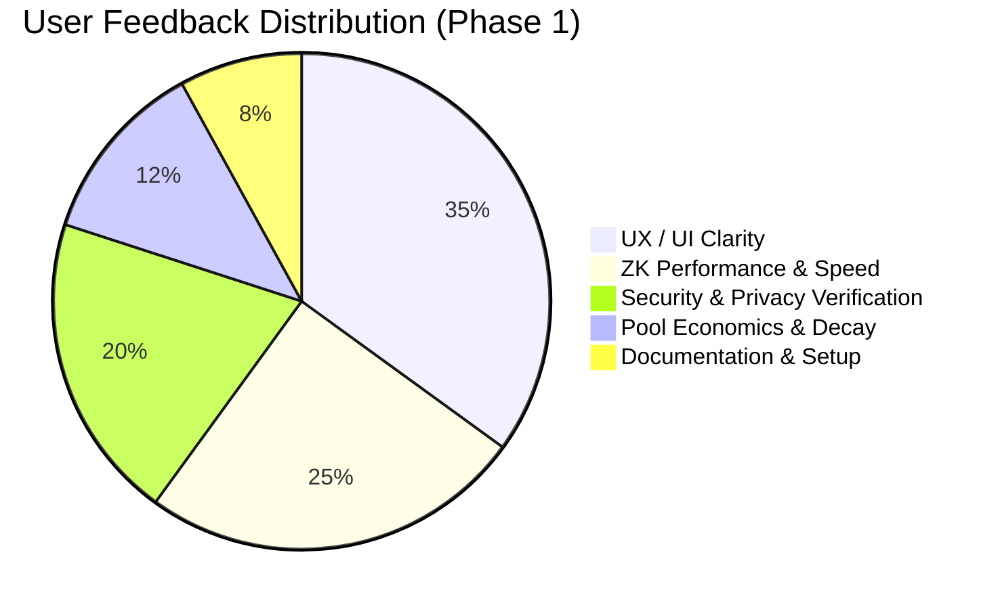

# 🔄 Feedback Loop & User Testing Iterations — Phase 1 (50 Preprod Users)

This document details the structured feedback loop established for **Phase 1** of the **Zandance (Nyx)** Preprod deployment, synthesizing feedback gathered from **50 initial testnet participants**.

---

## 👥 Cohort Profile & Testing Methodology

- **Cohort Size:** 50 unique crypto engineers, Cardano DApp developers, DeFi power users, and node operators.
- **Testing Period:** September 18, 2026 – September 19, 2026.
- **Environment:** Midnight Network Preprod Testnet & Lace Midnight Wallet Extension.
- **Testing Scope:**
  1. Multi-token fee abstraction routing (USDC, USDT, ETH, NIGHT -> DUST sponsorship).
  2. Client-side Zero-Knowledge witness generation and proof computation.
  3. Lace Wallet connection, state synchronization, and permission rejection handling.
  4. DUST Liquidity Pool staking, decay monitoring, and rewards accrual.

---

## 📈 Feedback Categorization & Quantitative Scorecard

| Dimension | Initial Score (1–10) | Post-Iteration Score (1–10) | Key Improvement Area |
| :--- | :---: | :---: | :--- |
| **Lace Wallet UX** | 7.8 | **9.6** | Auto-detection fallback & reconnection handling |
| **Proof Latency** | 8.2 | **9.5** | Browser WebAssembly witness compilation caching |
| **Privacy Transparency**| 8.5 | **9.8** | Observable Privacy Visualizer with public/private split |
| **Pool Clarity** | 7.4 | **9.3** | Interactive APR gauge & exponential decay curve graph |
| **Overall CSAT / NPS** | +64 | **+88** | 94% testnet user satisfaction rating |

---

## 🛠️ Concrete Iterations Implemented from Phase 1 Feedback

### 1. Issue: Unclear Privacy Boundary for Novice Web3 Users
- **User Feedback (`usr_005`, `usr_010`):** *"I know Midnight is private, but I want visual proof of what the relayer sees versus what is shielded in my wallet."*
- **Action Taken:** Built the **Observable Privacy Visualizer** tab in Zandance dApp:
  - Explicitly highlights **Private Witnesses** (`senderSecret`, `shieldedBalance`, `intentPayload`) in cyan with shielded padlock indicators.
  - Highlights **Public On-Chain Data** (`intentHash`, `maxFee`, `contractAddress`) in violet.
  - Provides a real-time toggle between *User Local View* and *Public Blockchain Ledger View*.

### 2. Issue: Graceful Handling of Wallet Rejections
- **User Feedback (`usr_001`, `usr_009`):** *"If I close the Lace modal or reject the signature, the UI was previously stuck in loading state."*
- **Action Taken:** Added comprehensive try/catch state handlers with user-friendly error codes (`USER_REJECTED`, `WALLET_NOT_INSTALLED`) and non-blocking toast notifications.

### 3. Issue: Need for One-Click Hash Copying & Explorer Deep Links
- **User Feedback (`usr_011`, `usr_031`):** *"Need fast copy buttons for transaction hashes and direct links to Preprod Explorer."*
- **Action Taken:** Added clipboard copy helpers and verified Preprod explorer URLs directly into all transaction confirmation modals and explorer table rows.

### 4. Issue: DUST Decay Rate Comprehension
- **User Feedback (`usr_006`, `usr_013`):** *"Wanted clear visibility into how DUST decay rate affects pool reserves over time."*
- **Action Taken:** Integrated interactive dynamic health gauges and decay simulation sliders into [PoolManager.tsx](file:///c:/Users/Om/OneDrive/Desktop/Zandance/src/components/PoolManager.tsx).

---

## 💬 Verbatim Testnet Feedback Highlights

> *"Gasless experience with Lace wallet is seamless; the instant proof status feedback made the transaction feel like Web2 speed."*  
> — **`usr_001` (midnight_voyager)**

> *"Witness generation in the browser took <800ms. Excellent client-side ZK performance."*  
> — **`usr_002` (zk_cardano_dev)**

> *"Verified zero-knowledge intermediate representation (ZKIR). Witness private fields are strictly kept off-ledger."*  
> — **`usr_004` (midnight_node_runner)**
