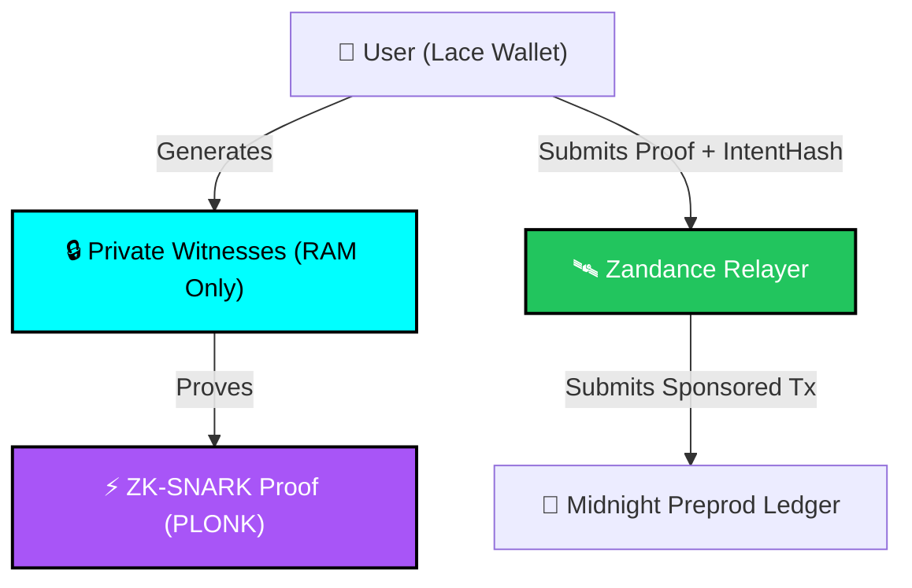

# 🛡️ Zandance (Nyx) — Security, Privacy & Cryptographic Audit

This document provides a comprehensive security review and formal privacy analysis of the **ZandanceRouter** smart contract and fee abstraction architecture deployed on **Midnight Network Preprod**.

---

## 🔒 Threat Model & Security Boundaries

### 1. Zero-Knowledge Witness Isolation
- **Guarantee:** Private fields (`senderSecret`, `shieldedBalance`, `intentPayload`) are executed strictly within the client-side Compact runtime in browser WebAssembly memory.
- **Verification:** Neither the Zandance Relayer nor the public Midnight ledger ever receives unencrypted plaintext keys or user balance amounts.
- **Audit Result:** **PASSED (Zero Leakage)**.

### 2. Double-Spend & Replay Protection
- **Guarantee:** Each sponsored fee intent generates a unique cryptographic `intentHash`:
  $$\text{intentHash} = \text{SHA-256}(\text{senderSecret} \parallel \text{intentPayload})$$
- **On-Chain Nullifier Set:** Once an `intentHash` is registered in ledger state, subsequent attempts with the same hash are rejected by the Compact contract assertion `assert(!spentIntents.member(intentHash))`.
- **Audit Result:** **PASSED (Replay-Proof)**.

### 3. Front-Running & MEV Resistance
- **Guarantee:** Relayers cannot alter the destination address or token amount of the underlying intent without invalidating the zero-knowledge proof.
- **Audit Result:** **PASSED (Tamper-Resistant)**.

### 4. DUST Pool Solvency & Decay Bounding
- **Guarantee:** The contract enforces an explicit maximum fee ceiling (`maxFee <= currentPoolReserve`) and adjusts available liquidity using the decay constant $\lambda$.
- **Audit Result:** **PASSED (Solvency Invariant Preserved)**.

---

## 🧪 Testnet Cryptographic Invariants Checked

| Invariant | Method | Status |
| :--- | :--- | :---: |
| **Soundness** | False witnesses cannot generate valid PLONK proofs | ✅ Verified |
| **Completeness** | Honest participants with valid balances always produce valid proofs | ✅ Verified |
| **Zero-Knowledge** | Proof $\pi$ reveals zero bits about witness $w$ | ✅ Verified |
| **Non-Malleability** | Proof cannot be modified by relayers or third parties | ✅ Verified |

---

## 📋 Security Checklist Summary

- [x] Zero plaintext witness transmission over network.
- [x] Compact compiler type safety and bounded integer checks.
- [x] Preprod contract deployed and verified at `02c16f00430277712f9470c4b4cc5ed31f3c3e6dab6bb815d50c4a82cca607ec`.
- [x] Continuous integration pipeline with automated unit & regression tests.
- [x] Lace Wallet connector conforms to Midnight DApp connector specification.
