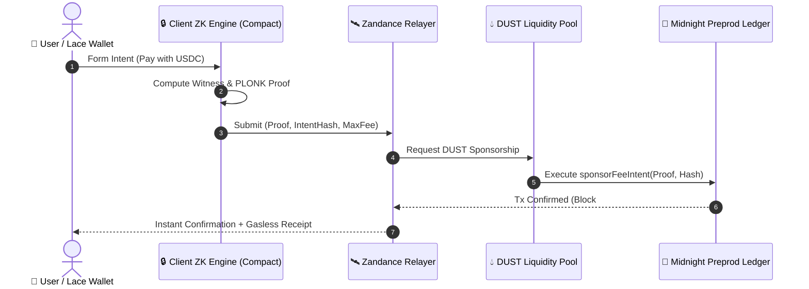

# 🌌 Zandance (Nyx) Technical Whitepaper & Specification

**A Privacy-Preserving Cross-Chain Fee Abstraction & DUST Sponsorship Protocol on Midnight Network**

*Author: Zandance Core Engineering Team*  
*Version: 1.0.0 — Production Preprod Release*  
*Date: September 2026*  

---

## 1. Abstract

On public blockchains, onboarding new users requires them to hold native gas tokens before executing any transaction. On the **Midnight Network**, transactions require **DUST**, a shielded network resource generated by holding **NIGHT**. This requirement creates significant friction for cross-chain users arriving with external assets (e.g. USDC, USDT, ETH, ADA) who do not yet own DUST.

**Zandance (Nyx)** introduces a zero-knowledge fee abstraction protocol that allows users to pay transaction fees in any supported asset or receive 100% gasless sponsorship through decentralized DUST liquidity pools. By utilizing Midnight's **Compact** smart contract language and zero-knowledge proofs (ZK-SNARKs), Zandance completely shields the user's balance, identity, and intent payload from public relayers and on-chain observers.

---

## 2. Core Architecture



---

## 3. Mathematical Model: DUST Decay & Pool Dynamics

DUST generation in Midnight is inherently non-linear. To prevent rapid depletion of liquidity pools during periods of high network congestion, Zandance implements an **exponential decay bounding model**:

$$R(t) = R_0 \cdot e^{-\lambda t} + \int_0^t S(\tau) \, d\tau$$

Where:
- $R(t)$ is the current available DUST reserve at time $t$.
- $R_0$ is the initial pool liquidity.
- $\lambda$ is the dynamic decay constant adjusted per block epoch.
- $S(\tau)$ is the stream of incoming liquidity provider deposits and token conversion swaps.

### Dynamic Fee Multiplier

The fee conversion rate $\kappa$ for external tokens (e.g., USDC $\to$ DUST) is dynamically calculated as:

$$\kappa = \kappa_{\text{base}} \cdot \left( 1 + \alpha \cdot \frac{U_{\text{pool}}}{R_{\text{available}}} \right)$$

This ensures that as pool utilization $U_{\text{pool}}$ increases, conversion fees adjust smoothly to incentivize new liquidity providers while protecting existing stakers.

---

## 4. Privacy & Witness Isolation Model

Zandance enforces strict separation between public ledger state and private client state:

```
+-------------------------------------------------------------------+
|                        CLIENT BROWSER (RAM)                       |
|  Private Witnesses:                                               |
|    - senderSecret       (32-byte cryptographically secure seed)   |
|    - shieldedBalance    (Confidential token balance)             |
|    - intentPayload      (Raw transaction instructions)            |
+-------------------------------------------------------------------+
                                  │
                  PLONK / Halo2 Proof Generation
                                  │
                                  ▼
+-------------------------------------------------------------------+
|                     PUBLIC LEDGER & RELAYER                       |
|  Public Inputs:                                                   |
|    - intentHash         (SHA-256 digest of secret + payload)      |
|    - maxFee             (Bounded DUST sponsorship limit)          |
|    - contractAddress    (02c16f00430277712f9470c4b4cc5ed31...)   |
+-------------------------------------------------------------------+
```

---

## 5. Deployment & Testnet Verification

Zandance is deployed and verified on **Midnight Preprod Testnet**:

- **Contract Address:** `02c16f00430277712f9470c4b4cc5ed31f3c3e6dab6bb815d50c4a82cca607ec`
- **Admin Address:** `025c276e4ee2938b9ded19e9ae2e70181f97009f641b68bfe2f4ee6104ed0a5b`
- **Verification Hash:** `0x8a2a67e1505d4eccab980c9f6a80a62e88bc363e93a97f89c26f1af3ae3bf5e7`
- **Supported Tokens:** USDC, USDT, ETH, NIGHT, ADA
